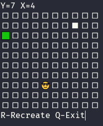

# Game of pushing blocks

## How to play
Try to push the white square to the green square  
The game generate a new map every time

## Comands
W - Go Up  
A - Go Left  
S - Go Down  
D - Go Right  
R - Recreate Level
Q - Exit the game

## About
It is just a basic game to learn c++ basics.  
The code for this project is pretty bad, so feel free to contribute to the project.
